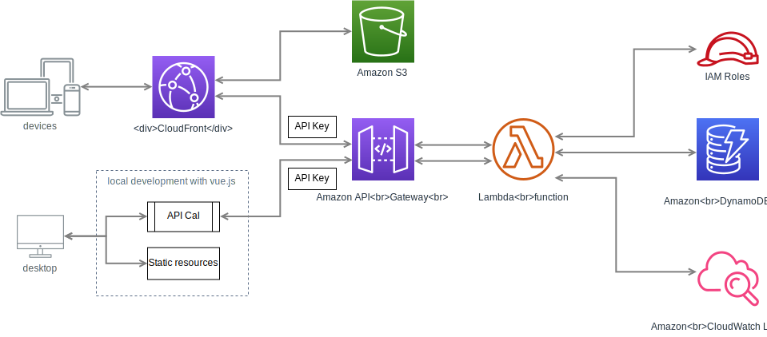

# CloudFormation

## DynamoDB
## Main body
- IAM Role
- API Gateway
  - Stage (plural)
    - LogGroup
  - Deployment (plural)
  - Method (plural)
  - API Key
  - ClientCertificate
  - UsagePlan
  - UsagePlanKey
- Lambda (plural)
  - LogGroup
## CloudFront
- S3
  - Bucket
  - BucketPolicy
- CloudFront
  - OriginAccessIdentity
  - Distribution
